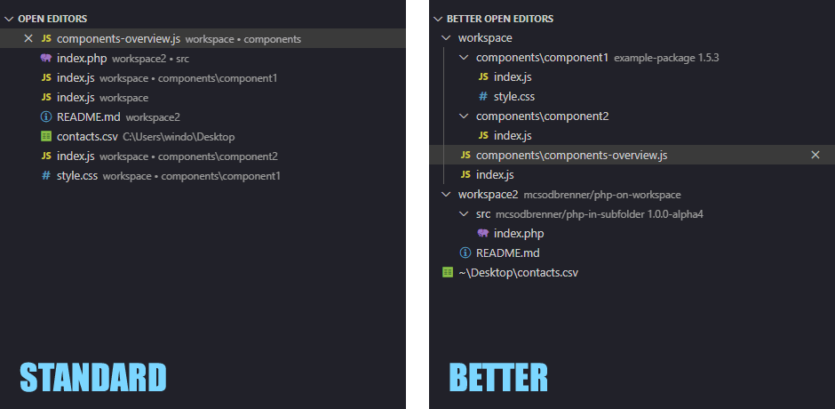
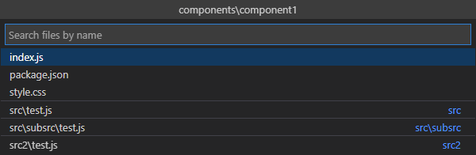

# Better Open Editors

This is a replacement for the Open Editors panel, which becomes very cluttered with many open files. Especially in projects with package folders (e.g. in monorepos) you often have many files with the same name open and have difficulties to distinguish them.

Therefore, this extension helps to group open files in package folders (defined by package.json or composer.json) or in folders defined by setting.

**Quick Pick feature to open only files of the current package**

## Features

  * Automatically detects packages (package.json, composer.json).
  * Specification of RegExp patterns to build custom "virtual" package folders.
  * Supports multiple workspace folders.
  * Supports tab groups.
  * Platform independent.
  * Quick pick to select only files of the currently selected package (Keyboard shortcuts "`betterOpenEditors.openFileOfCurrentPackage`").

## Package folder generation

The main purpose of the extension is to group files automatically that belong to packages. For this it is looked whether there is a package.json/composer.json in a folder or whether a package corresponds to a glob pattern from the settings.
If indeed all folders should be displayed as package folders, it is also possible to pass `**` as pattern.
Package folders, which only contain other folders, are not created.

## Known Issues

* Meta tabs like the "Settings" tab are currently not visible as the API does not offer a possibility to get the internal URI of those tabs (https://github.com/microsoft/vscode/issues/158853).
